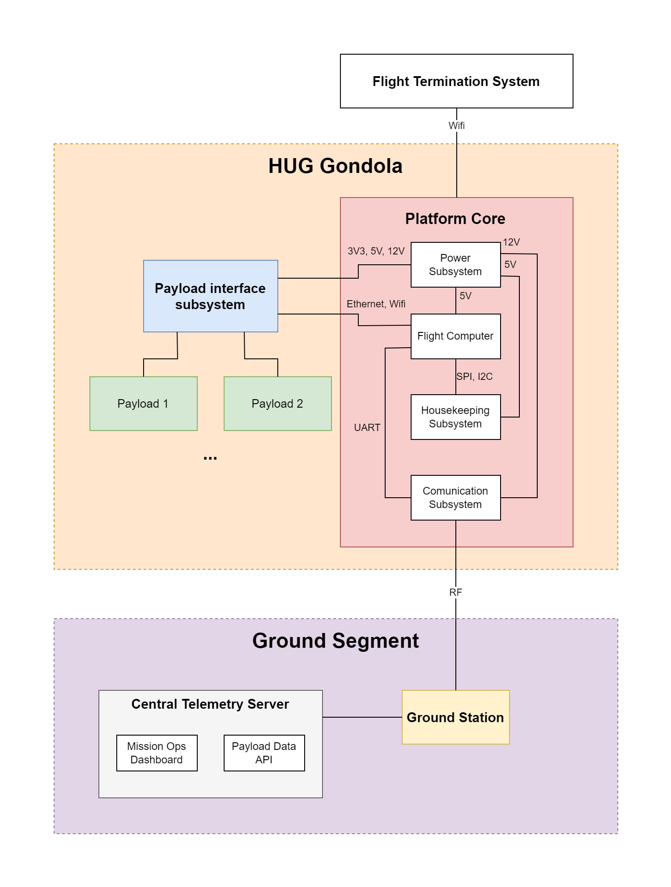

# HUG Platform Architecture

Version: Draft v0.1
Project: HUG — High-Altitude Universal Gondola
Organization: Balloon Section, Students’ Space Association, Warsaw University of Technology

---

# 1. Purpose and Scope

This document defines the high-level architecture of the HUG (High-Altitude Universal Gondola) platform.

The document combines:

* functional architecture,
* logical system architecture,
* subsystem responsibilities,
* operational function allocation,
* high-level system interactions.

The purpose of this document is to describe:

* what the platform does,
* how the platform is logically organized,
* how primary subsystems interact,
* how payloads interface with the platform,
* how mission operations are supported.

Implementation-specific hardware and software details are intentionally excluded.

---

# 2. System Overview and High-Level Architecture

HUG is a reusable modular stratospheric balloon platform intended to support scientific and technological payloads during high-altitude balloon missions.

The platform separates reusable flight infrastructure from mission-specific payload implementation.



*Figure 1 — HUG High-Level System Architecture*

The system consists of three primary architectural domains:

```text
Hosted Payloads
        ↕
HUG Flight Platform
        ↕
Ground Segment
```

The onboard platform acts as an intermediary layer between hosted payloads and mission operations infrastructure.

Primary architectural domains include:

- Hosted Payload Domain
- Flight Platform Domain
- Ground Segment Domain

---

# 4. Primary System Functions

At the highest level, the HUG platform performs the following primary operational functions:

```text
HUG System
├── Provide Electrical Power
├── Provide Payload Services
├── Acquire Housekeeping Data
├── Determine Position and Flight State
├── Communicate With Ground Segment
├── Store Mission Data
├── Manage Mission Operations
├── Support Flight Safety
└── Provide Ground Infrastructure Services
```

---

# 5. Functional Decomposition

## 5.1 Provide Electrical Power

The platform shall provide electrical energy storage, regulation, monitoring, and distribution services.

### Subfunctions

```text
Provide Electrical Power
├── Store Electrical Energy
├── Generate Regulated Voltage Rails
├── Monitor Power Consumption
├── Monitor Battery State
├── Protect Against Electrical Faults
└── Distribute Power to Payloads
```

---

## 5.2 Provide Payload Services

The platform shall provide standardized payload integration and operational support services.

### Subfunctions

```text
Provide Payload Services
├── Provide Mechanical Interfaces
├── Provide Electrical Interfaces
├── Provide Data Interfaces
├── Exchange Payload Telemetry
├── Support Multiple Payload Configurations
└── Abstract Platform Implementation Details
```

---

## 5.3 Acquire Housekeeping Data

The platform shall monitor internal system state and environmental conditions during mission operation.

### Subfunctions

```text
Acquire Housekeeping Data
├── Monitor Internal Temperature
├── Monitor External Temperature
├── Monitor Voltage and Current
├── Monitor Communication Status
├── Monitor System Health
└── Acquire Environmental Measurements
```

---

## 5.4 Determine Position and Flight State

The platform shall determine and distribute mission position and operational state information.

### Subfunctions

```text
Determine Position and Flight State
├── Acquire GNSS Position
├── Determine Altitude
├── Determine Ground Speed
├── Track Mission Trajectory
└── Provide Position Data
```

---

## 5.5 Communicate With Ground Segment

The platform shall exchange telemetry and command data with ground infrastructure.

### Subfunctions

```text
Communicate With Ground Segment
├── Transmit Telemetry
├── Receive Telecommands
├── Route Payload Data
├── Maintain RF Communication Link
├── Support Bidirectional Communication
└── Support Real-Time Monitoring
```

---

## 5.6 Store Mission Data

The platform shall store operational and payload-related mission data.

### Subfunctions

```text
Store Mission Data
├── Store Housekeeping Telemetry
├── Store Payload Data
├── Buffer Communication Data
├── Preserve Data During Link Loss
└── Support Post-Flight Data Extraction
```

---

## 5.7 Manage Mission Operations

The platform shall support execution and supervision of mission operations throughout the flight lifecycle.

### Subfunctions

```text
Manage Mission Operations
├── Support Pre-Flight Verification
├── Support Launch Operations
├── Support Autonomous Operation
├── Support Recovery Operations
└── Maintain Mission State Awareness
```

---

## 5.8 Support Flight Safety

The platform shall support safe mission operation and recovery.

### Subfunctions

```text
Support Flight Safety
├── Support Flight Termination
├── Monitor Critical System State
├── Support Abort Operations
├── Maintain Recovery Tracking
└── Support Safe System Operation
```

---

## 5.9 Provide Ground Infrastructure Services

The ground segment shall support mission supervision and telemetry distribution.

### Subfunctions

```text
Provide Ground Infrastructure Services
├── Receive RF Telemetry
├── Aggregate Mission Data
├── Provide Mission Monitoring Interfaces
├── Provide Payload Data Access
├── Archive Mission Data
└── Support Remote Monitoring
```

---

# 6. Architectural Domains

## 6.1 Hosted Payload Domain

The hosted payload domain consists of scientific, educational, and technological experiments integrated into the platform.

Payloads interface with the platform through standardized mechanical, electrical, and communication interfaces.

Payloads may:

* operate autonomously,
* exchange telemetry with the platform,
* use platform-provided services,
* operate from independent power systems.

---

## 6.2 Flight Platform Domain

The flight platform domain contains reusable onboard infrastructure responsible for mission operation, telemetry acquisition, communication, payload support, and operational supervision.

The onboard platform includes:

* Payload Interface Subsystem
* Flight Computer
* Communication Subsystem
* Housekeeping Subsystem
* Power Subsystem
* Flight Termination System

---

## 6.3 Ground Segment Domain

The ground segment domain provides mission supervision, telemetry reception, operational coordination, and payload data access.

The ground segment includes:

* Ground stations
* RF infrastructure
* Telemetry servers
* Mission operations software
* Monitoring interfaces

---

# 7. Platform Core Subsystems

## 7.1 Payload Interface Subsystem

The Payload Interface Subsystem provides standardized interfaces between hosted payloads and the flight platform.

Primary responsibilities include:

* payload electrical interfaces,
* payload data interfaces,
* telemetry exchange,
* payload service abstraction,
* payload integration support.

Supported interface categories may include:

| Interface Type | Purpose                         |
| -------------- | ------------------------------- |
| Power          | Payload power distribution      |
| Ethernet       | High-rate payload communication |
| Wi‑Fi          | Wireless payload access         |
| Telemetry      | Shared telemetry exchange       |

The subsystem abstracts internal platform implementation details from hosted payloads.

---

## 7.2 Flight Computer

The Flight Computer acts as the central onboard coordination and processing element.

Primary responsibilities include:

* mission state supervision,
* telemetry aggregation,
* payload data routing,
* data logging,
* communication coordination,
* interface management.

The Flight Computer acts as the authoritative source of mission operational state.

---

## 7.3 Communication Subsystem

The Communication Subsystem provides bidirectional communication between the platform and the ground segment.

Primary responsibilities include:

* telemetry downlink,
* telecommand uplink,
* RF link management,
* payload data transport,
* communication buffering,
* ground station connectivity.

The subsystem supports operation during intermittent communication coverage conditions.

---

## 7.4 Housekeeping Subsystem

The Housekeeping Subsystem monitors platform operational state and environmental conditions.

Primary responsibilities include:

* internal temperature monitoring,
* external temperature monitoring,
* voltage and current monitoring,
* battery telemetry,
* environmental sensing,
* GNSS positioning.

The subsystem provides housekeeping telemetry to the Flight Computer for mission supervision and recovery support.

---

## 7.5 Power Subsystem

The Power Subsystem provides electrical energy storage, regulation, monitoring, and distribution services.

Primary responsibilities include:

* battery integration,
* voltage regulation,
* power distribution,
* electrical monitoring,
* fault protection,
* payload power support.

Payload power distribution may remain electrically isolated from platform-critical services.

---

## 7.6 Flight Termination System

The Flight Termination System (FTS) supports mission abort and controlled flight termination operations.

Primary responsibilities include:

* flight termination control,
* balloon cutdown operations,
* safety response support,
* emergency operational handling.

The FTS is intended to remain operational independently from non-critical payload systems.

---

# 8. Inter-Subsystem Interfaces

| Source                      | Destination             | Interface Type         |
| --------------------------- | ----------------------- | ---------------------- |
| Payload Interface Subsystem | Flight Computer         | Ethernet / UART        |
| Housekeeping Subsystem      | Flight Computer         | Internal telemetry bus |
| Flight Computer             | Communication Subsystem | Packetized telemetry   |
| Power Subsystem             | Platform Subsystems     | Regulated power rails  |
| Communication Subsystem     | Ground Segment          | RF communication link  |

---

# 9. Functional Interfaces

| Function                               | Input                  | Output                              |
| -------------------------------------- | ---------------------- | ----------------------------------- |
| Provide Electrical Power               | Battery energy         | Regulated power rails               |
| Provide Payload Services               | Payload connections    | Payload access services             |
| Acquire Housekeeping Data              | Sensor measurements    | Housekeeping telemetry              |
| Determine Position and Flight State    | GNSS and sensor data   | Position and mission state          |
| Communicate With Ground Segment        | Telemetry and commands | RF data exchange                    |
| Store Mission Data                     | Telemetry streams      | Persistent mission records          |
| Manage Mission Operations              | Operational procedures | Mission state coordination          |
| Support Flight Safety                  | Critical system status | Safety actions and tracking         |
| Provide Ground Infrastructure Services | RF telemetry           | Mission monitoring and distribution |

---

# 10. Operational States

The platform supports the following primary operational states:

```text
System Operational States
├── Pre-Flight
├── Launch
├── Ascent
├── Float
├── Descent
├── Recovery
└── Safe Mode
```

---

# 11. Data Flow Overview

## 11.1 Telemetry Flow

```text
Payloads / Platform Sensors
            ↓
Payload Interface Subsystem
            ↓
Flight Computer
            ↓
Communication Subsystem
            ↓
Ground Segment
            ↓
Mission Operators / Payload Teams
```

---

## 11.2 Command Flow

```text
Mission Operators
            ↓
Mission Operations Software
            ↓
Ground Segment
            ↓
Communication Subsystem
            ↓
Flight Computer
            ↓
Payloads / Flight Safety Functions
```

---

## 11.3 Power Distribution Flow

```text
Battery System
            ↓
Power Subsystem
            ↓
Platform Subsystems
            ↓
Payload Interface Subsystem
            ↓
Hosted Payloads
```

---

# 12. Fault Isolation Philosophy

The architecture is designed to isolate hosted payload failures from platform-critical functions.

The system architecture supports:

* independent operation of platform-critical services,
* autonomous operation during communication loss,
* isolation of payload-related electrical faults,
* continued tracking during payload malfunction,
* separation between mission safety and payload operations.

Payload faults shall not compromise telemetry, positioning, tracking, or flight safety services.

---

# 13. Architectural Constraints

The platform architecture is designed under the following operational constraints:

* limited onboard electrical power availability,
* intermittent RF communication coverage,
* harsh thermal operating conditions,
* limited onboard mass and volume,
* payload modularity requirements,
* recovery-oriented mission operation.

---

# 14. Conclusion

This document defines the high-level architecture of the HUG platform including:

* primary operational functions,
* architectural domains,
* subsystem responsibilities,
* inter-subsystem interfaces,
* mission support services.

The architecture establishes the foundation for:

* requirements engineering,
* interface definition,
* subsystem implementation,
* verification planning,
* future platform expansion.
